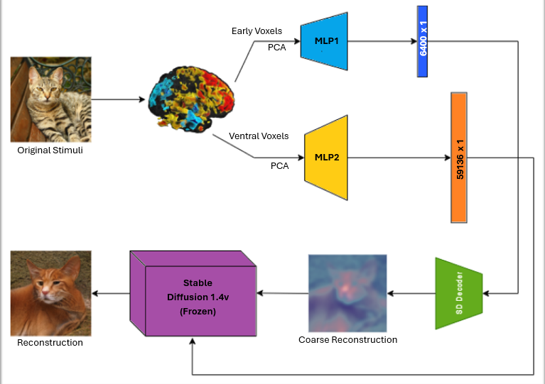
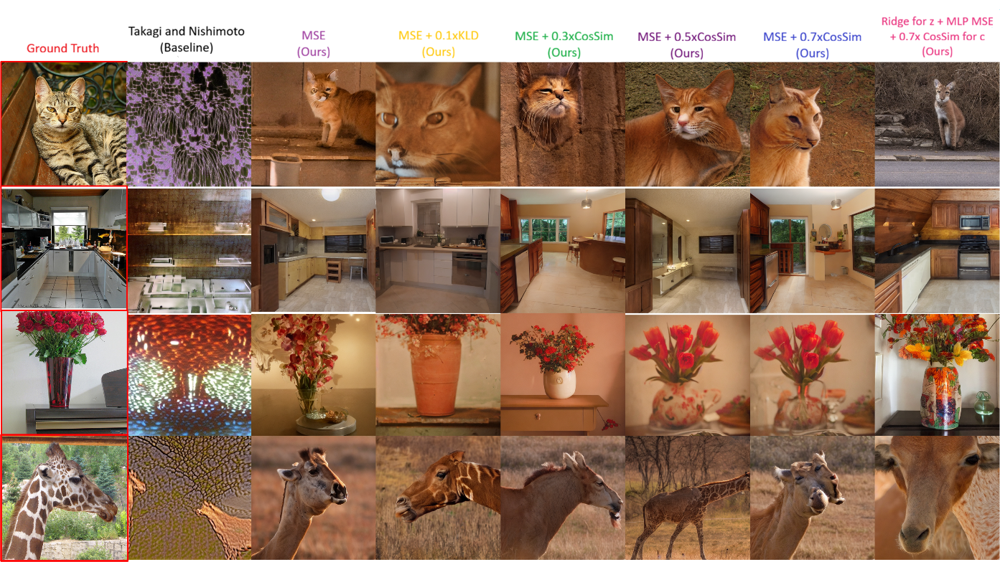
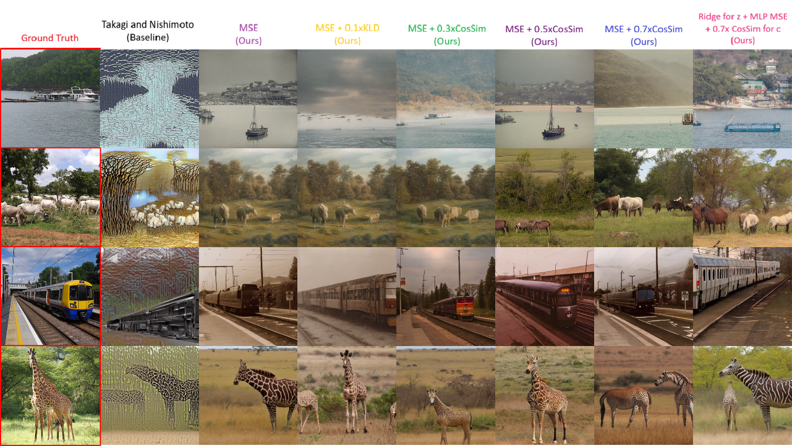

# RetinaReplay — Generative Reconstruction of Visual Perceptions from Brain fMRI Data

<p align="center">
  
</p>

<p align="center">
  <a href="https://arxiv.org/abs/XXXX.XXXXX"></a>
  <a href="https://huggingface.co/datasets/IshantSingh94/RetinaReplay"></a>
  <a href="LICENSE"></a>
  
  
</p>

---

> **RetinaReplay** is a lightweight fMRI-to-image reconstruction framework that replaces the linear ridge-regression encoders of the [Takagi & Nishimoto (CVPR 2023)](https://arxiv.org/abs/2303.05334) baseline with nonlinear MLP encoders trained with composite loss functions, achieving substantial improvements in both encoder correlation and downstream perceptual reconstruction quality — without the overhead of current state-of-the-art pipelines.

---

## Results at a Glance

### Encoder Performance (Held-out Test Set, Subject 1 NSD)

| ROI | Model | Mean Pearson r | Δr vs Baseline |
|---|---|:---:|:---:|
| Early Visual Cortex | Ridge Regression (Takagi & Nishimoto) | 0.239 | — |
| Early Visual Cortex | **MLP (Ours)** | **0.306** | **+28%** |
| Ventral Visual Cortex | Ridge Regression (Takagi & Nishimoto) | 0.304 | — |
| Ventral Visual Cortex | **MLP (Ours)** | **0.767** | **+152%** |

### Downstream Reconstruction Quality (100 Test Images)

| Method | Encoder | Loss | PSM ↑ | SFS ↑ |
|---|---|---|:---:|:---:|
| Takagi & Nishimoto | Ridge | MSE | 0.457 | 0.275 |
| **Ours** | MLP | MSE | 0.542 | **0.359** |
| **Ours** | MLP | MSE + 0.1×KLD | 0.546 | 0.355 |
| **Ours** | MLP | MSE + 0.3×CosSim | 0.540 | 0.355 |
| **Ours** | MLP | MSE + 0.5×CosSim | 0.547 | 0.356 |
| **Ours** | MLP | MSE + 0.7×CosSim | **0.559** | 0.354 |
| **Ours (hybrid)** | Ridge (z) + MLP (c) | Mixed | **0.579** | 0.344 |

> **PSM** = AlexNet Perceptual Similarity Metric · **SFS** = CLIP Semantic Fidelity Score · Higher is better for both.

---

## Qualitative Comparisons


*Col 1 (red border): Ground Truth · Col 2: Takagi & Nishimoto baseline · Cols 3–8: RetinaReplay variants*



> RetinaReplay reconstructions show **sharper structure**, **improved semantic coherence**, and **reduced checkerboard artifacts** consistently present in the ridge regression baseline.

---

## Method Overview

RetinaReplay builds directly on the dual-pathway conditioning framework of Takagi & Nishimoto, replacing their ridge-regression encoders with four targeted improvements:

| Contribution | Description |
|---|---|
| **MLP Encoders** | Nonlinear feedforward networks replace ridge regression for both Early and Ventral cortex pathways |
| **PCA Compression** | Dimensionality reduction applied prior to each MLP, reducing parameters by 34.2% while preserving reconstruction quality |
| **ELU Activation** | Smooth gradient flow, near-zero mean activations, selected via systematic ablation |
| **Composite Loss** | MSE combined with cosine-similarity loss and KL Divergence, targeting both magnitude and directional alignment |

> Full architectural details, ablation tables, and methodology are described in the [paper](https://arxiv.org/abs/XXXX.XXXXX).  
> Training code is not released. Reproduction is supported via pre-decoded prediction files (see below).

---

## Repository Structure

```
RetinaReplay/
│
├── README.md
├── LICENSE                         ← CC BY-NC-ND 4.0
├── requirements.txt
│
├── stage1_preprocessing/           ← fMRI & stimulus preprocessing
│   ├── make_subjmri.py             ← ROI beta extraction (Dask-optimised)
│   ├── img2feat_sd.py              ← Image & caption → SD/CLIP embeddings
│   └── make_subjstim.py            ← Subject-specific feature stacking
│
├── stage3_reconstruction/          ← Image reconstruction from predictions
│   └── reconstruct.py             ← Requires gated HuggingFace access
│
├── stage4_evaluation/              ← Perceptual & semantic evaluation
│   └── evaluate.py                ← AlexNet PSM + CLIP SFS scoring
│
└── assets/                         ← Figures, diagrams
```

> **Stage 2 (Training)** is intentionally not included.  
> Pre-decoded `.npy` prediction files are available via gated access below.

---

## Reproducing Results

### Step 1 — Request Access

Pre-decoded prediction files and Stable Diffusion v1.4 weights are hosted on HuggingFace under gated access:

👉 **[Request Access — HuggingFace Dataset](https://huggingface.co/datasets/IshantSingh94/RetinaReplay)**

Provide your name, institution, and intended use. Access is granted for research and educational purposes.

Once approved, generate a HuggingFace token at `Settings → Access Tokens` and set:

```bash
export RETINAREPLAY_TOKEN=your_hf_token_here
```

### Step 2 — Install Dependencies

```bash
git clone https://github.com/IshantNaru/RetinaReplay
cd RetinaReplay
pip install -r requirements.txt

# Clone Stable Diffusion v1.4 into the expected location
mkdir -p codes/diffusion_sd1
git clone https://github.com/CompVis/stable-diffusion codes/diffusion_sd1/stable-diffusion
cd codes/diffusion_sd1/stable-diffusion && pip install -e . && cd ../../..

# Download sd-v1-4.ckpt from https://huggingface.co/CompVis/stable-diffusion-v1-4
# Place it at:
# codes/diffusion_sd1/stable-diffusion/models/ldm/stable-diffusion-v1/sd-v1-4.ckpt
```

### Step 3 — Run Reconstruction

```bash
python stage3_reconstruction/reconstruct.py \
  --subject subj01 \
  --gpu 0 \
  --img_start 0 \
  --img_end 99 \
  --loss_config MSE_0.5Cos
```

The script will automatically download the required `.npy` files and SD weights using your token on first run.

### Step 4 — Run Evaluation

```bash
python stage4_evaluation/evaluate.py \
  --samples_dir ../../decoded/image-cvpr/subj01/samples
```

Outputs a CSV with per-image PSM and SFS scores and computes the mean across all evaluated images.

---

## Data Requirements

This project uses the **Natural Scenes Dataset (NSD)**:

> Allen, E.J. et al. "A massive 7T fMRI dataset to bridge cognitive neuroscience and artificial intelligence." *Nature Neuroscience*, 25, 116–126 (2022).

NSD requires separate access approval at [naturalscenesdataset.org](http://naturalscenesdataset.org).  
Preprocessing scripts in `stage1_preprocessing/` assume the standard NSD directory layout.

---

## Citation

If you use RetinaReplay in your research, please cite:

```bibtex
@article{naru2026retinareplay,
  title     = {RetinaReplay: Generative Reconstruction of Visual Perceptions
               from Brain fMRI Data via Lightweight MLP Encoders},
  author    = {Naru, Ishant},
  journal   = {arXiv preprint arXiv:XXXX.XXXXX},
  year      = {2026}
}
```

---

## Acknowledgements

Thanks to Dr. Kashif Rajpoot and Dr. Mian M. Hamayun at the University of Birmingham for supervision and guidance.  
Thanks to the NSD team for making their dataset publicly available.  
This work builds on the framework of [Takagi & Nishimoto (CVPR 2023)](https://arxiv.org/abs/2303.05334).

---

## License

This repository is released under [CC BY-NC-ND 4.0](LICENSE).  
You may share with attribution. Commercial use and derivative works are not permitted.  
Pre-decoded prediction files are subject to additional terms of the gated access agreement.
